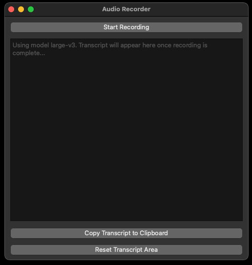

# Whisper Test Python UI

## Dev Installation

- built with Python version `3.9.18`
- `pip install -r requirements.txt`
- run with `python whisper_gui.py`

## Features

- simple audio transcription UI inspired by [MacWhisper](https://goodsnooze.gumroad.com/l/macwhisper), utilizes the [`faster-whisper`](https://github.com/SYSTRAN/faster-whisper) backend
- can modify `model_size` parameter in code to use all Whisper model sizes for free (MacWhisper limits to small, tiny, or base models)

## Known issues

- [ ] pyinstaller executable still buggy

## Future features:

- [ ] streaming - e.g. https://github.com/ufal/whisper_streaming
- [ ] have a separate section where you record some context for post-processing by another LLM (either API or local)
  - e.g. if you had a meeting, tell other LLM that the audio file was a transcript of a call, process it into key takeaways and action items

## UI improvements

- [ ] Model selection dropdown
- [ ] Recording dot animation when recording
